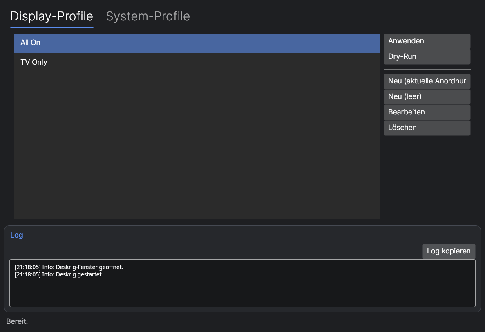

# Deskrig

[](https://github.com/DevBaka/Deskrig/actions/workflows/build.yml)
[](LICENSE)
[](#build--run) [](#build--run)

**Ein Klick, ganzer Rechner-Zustand wechselt.** Deskrig kombiniert einen Multi-Monitor-Display-Manager mit
System-Profilen: Monitor-Anordnung, laufende Programme, Audiogerät, Power-Plan, Dienste und ein paar
System-Einstellungen in einem einzigen Profil zusammenfassen und per Knopfdruck (oder Stream-Deck-Taste,
Verknüpfung, Hotkey) umschalten. Für Setups, die zwischen mehreren "Modi" wechseln - Arbeiten, Gaming,
Streaming/DJing, TV-only - und bei denen das von Hand jedes Mal ein halbes Dutzend Einzelschritte wäre.



Kein Backend, keine Cloud, keine Telemetrie - alles läuft lokal, Profile sind lesbares JSON.

## Warum

Windows und (die meisten) Linux-Desktops können einzelne Dinge davon schon selbst - Monitor-Layout hier,
Standard-Audiogerät da, Autostart-Programme woanders. Was fehlt, ist die Verknüpfung: "wenn ich in den
TV-Modus wechsle, soll gleichzeitig nur der Fernseher aktiv sein, die Lautstärke auf die Soundbar wechseln,
und Spotify starten." Deskrig bündelt das in einem Profil, das sich per CLI, Hotkey oder GUI in unter einer
Sekunde anwenden lässt.

## Features

- **Display-Profile**: Monitor-Anordnung (Position, Auflösung, Bildwiederholrate, Clone-Gruppen, DPI-Skalierung)
  als benanntes Profil speichern und wieder anwenden. Monitore werden über ihre EDID-Identität erkannt, nicht
  über Portnamen oder Indizes - Profile überleben Umstecken zwischen Anschlüssen.
- **System-Profile**: pro Profil kombinierbar - ein Display-Profil, Programme starten/beenden, Dienste
  starten/stoppen, Standard-Audioausgabe/-eingabe, Power-Plan, Prozess-Priorität, ein paar System-Toggles.
- **Restore Previous**: vor jedem Anwenden wird automatisch ein Snapshot des vorherigen Zustands angelegt -
  ein Klick macht ihn rückgängig.
- **CLI + GUI**: die GUI für den Alltag, das CLI für Stream Deck/Automatisierung/Skripte
  (`deskrig --profile "TV"`).
- **Globale Hotkeys**, Tray-Icon mit Schnellzugriff auf alle Profile.
- Läuft nativ auf **Windows und Linux** (X11 und Wayland/KDE) aus derselben Codebasis.

## Build & Run

Voraussetzung: [.NET 8 SDK](https://dotnet.microsoft.com/download) (oder neuer).

```bash
git clone https://github.com/DevBaka/Deskrig.git
cd Deskrig
dotnet build Deskrig.slnx -c Debug

# GUI (unter Windows ggf. als Administrator starten - siehe unten):
dotnet run --project src/Deskrig.Desktop

# CLI:
dotnet run --project src/Deskrig.Cli -- display list
dotnet run --project src/Deskrig.Cli -- --profile "TV"
```

`Deskrig.Core` und `Deskrig.Cli` sind Multi-Target (`net8.0-windows;net8.0`) - pro TFM werden nur die
passenden Backend-Dateien kompiliert (kein `#if` in der eigentlichen Logik, nur ein paar Zeilen in den
sechs `*Service`-Fassaden, die zur Laufzeit das richtige Backend wählen). `Deskrig.Desktop` (die
Avalonia-GUI) zielt einfach auf `net8.0` - Avalonia selbst ist bereits plattformneutral, ist aber ebenfalls
Multi-Target, damit sie beim Publishen die richtige `Core`-Variante zieht (siehe unten).

Auf Windows haben `Deskrig.Desktop` und `Deskrig.Cli` ein `app.manifest` mit `requireAdministrator`, weil
Dienste-Steuerung und HKLM-Registry-Änderungen dort Admin-Rechte brauchen. `dotnet run` aus einer
nicht-erhöhten Shell löst deshalb eine UAC-Anfrage aus. Unter Linux braucht der Prozess selbst **keine**
Root-Rechte - einzelne Aktionen, die es nötig haben (`systemctl`-Änderungen an System-Diensten), fragen bei
Bedarf gezielt über `pkexec` nach, statt die ganze App elevated laufen zu lassen.

### Fertige, eigenständige Builds (kein .NET auf dem Zielrechner nötig)

Beim Publish immer `-f` **und** `-r` explizit angeben - die Projekte sind Multi-Target, ohne `-f` zieht
MSBuild sonst leicht die falsche `Core`-Variante (z. B. die Linux-Backends in einer Windows-exe, die dann
zur Laufzeit mit `PlatformNotSupportedException` abbricht):

```bash
# Linux x64, self-contained, single-file:
dotnet publish src/Deskrig.Desktop -c Release -f net8.0        -r linux-x64 --self-contained true \
  -p:PublishSingleFile=true -p:IncludeNativeLibrariesForSelfExtract=true -o ./publish/linux-x64/gui
dotnet publish src/Deskrig.Cli      -c Release -f net8.0        -r linux-x64 --self-contained true \
  -p:PublishSingleFile=true -p:IncludeNativeLibrariesForSelfExtract=true -o ./publish/linux-x64/cli

# Windows x64, self-contained, single-file (lässt sich auch von Linux aus cross-publishen):
dotnet publish src/Deskrig.Desktop -c Release -f net8.0-windows -r win-x64 --self-contained true \
  -p:PublishSingleFile=true -p:IncludeNativeLibrariesForSelfExtract=true -o ./publish/win-x64/gui
dotnet publish src/Deskrig.Cli      -c Release -f net8.0-windows -r win-x64 --self-contained true \
  -p:PublishSingleFile=true -p:IncludeNativeLibrariesForSelfExtract=true -o ./publish/win-x64/cli
```

Ergebnis jeweils eine einzelne ausführbare Datei (`Deskrig`/`Deskrig.exe` für die GUI, `Deskrig.Cli`/
`Deskrig.Cli.exe` fürs CLI) plus ein paar native Begleit-Bibliotheken (ICU, OpenSSL o. Ä.) im selben Ordner
- der Ordner muss komplett mitgenommen werden, nicht nur die exe.

### Laufzeit-Voraussetzungen unter Linux

Alles über ohnehin meist schon vorhandene CLI-Tools angesteuert (kein root nötig, außer wo unten
vermerkt); Paketname kann je nach Distro abweichen:

| Zweck | Tool | Paket (Beispiel) |
|---|---|---|
| Display (KDE/KWin) | `kscreen-doctor` | `kscreen` |
| Display (Fallback, X11/XWayland) | `xrandr` | `xorg-xrandr` |
| Audio | `pactl` | meist vorinstalliert (PipeWire/PulseAudio) |
| Power-Plan | `powerprofilesctl` | `power-profiles-daemon` |
| Dienste | `systemctl` | Teil von systemd |
| Elevation für Dienste-Änderungen | `pkexec` | `polkit` |
| Tray-Icon | - | Desktop mit StatusNotifierItem/AppIndicator |

Display-Backend wird automatisch gewählt: `kscreen-doctor`, sobald installiert und funktionsfähig (KDE
Plasma, auch unter Wayland), sonst `xrandr` (X11/XWayland). Details, warum das wichtig ist, unten bei den
Einschränkungen.

## Wo Profile liegen

```
Windows: %APPDATA%\Deskrig\
Linux:   $XDG_CONFIG_HOME/Deskrig/  (i. d. R. ~/.config/Deskrig/)
  profiles/display/*.json    Display-Profile (lesbares JSON, manuell editierbar)
  profiles/system/*.json     System-Profile
  logs/log_YYYYMMDD.txt      Tageslogs
  last-snapshot.json         Letzter Snapshot für "Restore Previous"
```

Ein minimales Display-Profil sieht so aus (`profiles/display/TV.json`):

```json
{
  "Name": "TV",
  "Displays": [
    { "HardwareId": "EDID-XXX-1234-00010000", "Active": true, "Primary": true,
      "PositionX": 0, "PositionY": 0, "Width": 1920, "Height": 1080, "RefreshRateHz": 60 },
    { "HardwareId": "EDID-AUS-5678-00000000", "Active": false }
  ]
}
```
`HardwareId` bekommt man über `deskrig display list`. Am einfachsten aber: Anordnung einmal wie gewünscht
einstellen, dann `deskrig display capture "TV"` bzw. in der GUI "Neu (aktuelle Anordnung)".

## Wie die Display-Zuordnung funktioniert

Jeder Monitor wird über eine **stabile, EDID-abgeleitete Hardware-Id** identifiziert statt über
Adapter-/Port-Index oder Portname - Profile überleben Umstecken in einen anderen Anschluss.

- **Windows**: über den CCD-Target-Device-Path (`QueryDisplayConfig`/`SetDisplayConfig`, gekapselt über das
  NuGet-Paket `WindowsDisplayAPI`), der die EDID-Herstellerkennung enthält.
- **Linux**: EDID direkt aus dem Kernel gelesen (`/sys/class/drm/cardN-<Anschluss>/edid` - derselbe Ort, aus
  dem KDE/GNOME selbst die Monitor-Identität lesen), daraus `EDID-<Hersteller>-<Produkt>-<Seriennummer>`
  abgeleitet. Angewendet wird je nach Session über eines von zwei Backends (automatische Auswahl):
  - **kscreen-doctor** (KDE/KWin) - spricht KWin direkt über dessen natives Output-Management-Protokoll an,
    ein atomarer Aufruf mit `output.<name>.<einstellung>`-Tokens pro Ausgang. Funktioniert zuverlässig auch
    unter Wayland, inkl. echter DPI-Skalierung (KDE meldet den tatsächlichen Faktor).
  - **xrandr** (Fallback für X11/andere Desktops) - ein Aufruf mit einer `--output`-Klausel pro Monitor.
    Degradiert kontrolliert statt komplett abzubrechen, falls Teile abgelehnt werden (siehe Einschränkungen).

Anordnungen mit gemeinsamer `Group`-Nummer > 0 werden gespiegelt (Clone) auf eine gemeinsame Quelle gelegt;
`Group = 0` heißt "eigene erweiterte Quelle" - das erlaubt gemischte Topologien (z. B. zwei Displays
gespiegelt, zwei normal erweitert) in einem einzigen Profil.

## Bekannte Einschränkungen

**Linux:**
- **xrandr ist unter Wayland-Sessions grundsätzlich unzuverlässig** (gegen eine echte KDE-Plasma-Wayland-
  Session verifiziert): XWayland meldet dort teils falsche Auflösungen/Bildwiederholraten und nimmt
  Schreibzugriffe (Position, Abschalten, Bildschirmgröße) klaglos entgegen (`exit 0`), ohne real etwas zu
  ändern - eine Eigenschaft der jeweiligen Compositor-XWayland-Implementierung, nicht von xrandr selbst,
  lässt sich clientseitig nicht umgehen. Deshalb die automatische Bevorzugung von `kscreen-doctor` unter
  KDE. Für GNOME/Mutter und wlroots-Compositors (Sway, Hyprland, ...) gibt's noch kein natives Backend, nur
  den unzuverlässigen xrandr-Fallback - ein `wlr-randr`- bzw. Mutter-D-Bus-Backend lässt sich später hinter
  demselben `IDisplayBackend`-Interface ergänzen (Beiträge willkommen).
- **DPI-Skalierung**: über kscreen-doctor echt, über den xrandr-Fallback nur eine grobe Annäherung
  (`xrandr --scale`, reines Pixel-Scaling statt echter HiDPI-Textskalierung).
- **Globale Hotkeys** nur unter X11/XWayland (eigene X11-Verbindung, `XGrabKey`) - unter nativem Wayland
  gibt's dafür keine App-seitige API, die Registrierung meldet das klar statt still nichts zu tun.
- **Windows-only-Einstellungen ausgeblendet**: Registry-Toggles, HAGS, FocusAssist, Windows-Update-Zeiten,
  Prozessor-Scheduling haben kein sinnvolles Linux-Äquivalent und tauchen im Editor gar nicht erst auf.
- **Dienste-Starttyp** mappt `Automatic`/`Manual`/`Disabled` auf `systemctl enable`/`disable`/`mask` - nicht
  1:1 dieselbe Semantik wie Windows, aber die nächstliegende Entsprechung.

**Windows:**
- **FocusAssist**/**Windows-Update-Zeiten**: keine stabile öffentliche Registry-/API-Schnittstelle,
  FocusAssist wird über die Toast-Benachrichtigungs-Einstellung angenähert. Kann auf manchen Builds nicht
  wirken.
- **Auflösung/Bildwiederholrate**: wird nur exakt übernommen, wenn sie bereits im aktiven Modus enthalten
  ist - sonst greift der EDID-bevorzugte Modus des Monitors (mit Warnung).
- **Hardwarebeschleunigtes GPU-Scheduling**: Registry-Wert wird korrekt gesetzt, braucht aber einen Windows-
  Neustart, um zu wirken.

## Gegen echte Hardware getestet

**Windows:** Monitor-Erkennung/-Zuordnung, Display-Profil anwenden (Reshuffle, Deaktivieren/Reaktivieren,
gemischte Clone+Extend-Topologie), System-Profil anwenden (Settings-Toggles über `reg.exe` verifiziert,
Prozessor-Scheduling, Programme starten/beenden, Audio-/Dienste-Enumeration) - 4-Monitor-System.

**Linux:** gegen eine 4-Monitor-Workstation mit KDE Plasma/Wayland, PipeWire, systemd. Display-Profil
anwenden ist der kritische Teil und wurde tatsächlich verifiziert, nicht nur "kein Fehler": ein Profil mit
nur einem aktiven Ausgang schaltet die anderen wirklich ab (per `kscreen-doctor -j` bestätigt, nicht nur
`exit 0`), ein Profil mit allen Displays schaltet sie zuverlässig mit korrekten Positionen/korrektem
Primary wieder an. CLI-Backends (Display/Audio/Dienste) liefern reale Daten. GUI startet, rendert korrekt,
Display-Profil-Editor zeigt die echte Topologie.

Nicht durchgeklickt: System-Profil-Editor/Picker/Modus-Dialog im Detail, Tray-Kontextmenü, globale Hotkeys
unter echtem X11, das xrandr-Fallback-Backend gegen eine echte Nicht-KDE-Session. Bitte einmal
durchklicken, bevor produktiv genutzt wird.

## Absichtlich nicht enthalten

Aus einem WinForms-Vorgängerprojekt wurden Digital-Vibrance/NVIDIA-Steuerung, Winget/Chocolatey-
Paketmanager, 1ms-Timer-Resolution und Defender/OneDrive/Telemetrie-Tweaks bewusst nicht übernommen - nicht
Teil der Spezifikation dieses Projekts.

## Mitmachen

Issues und PRs willkommen - besonders ein natives Display-Backend für GNOME/Mutter oder wlroots-Compositors
(Sway, Hyprland, ...) wäre eine sinnvolle Ergänzung, siehe `IDisplayBackend` in `Deskrig.Core`.

## Lizenz

[MIT](LICENSE)
